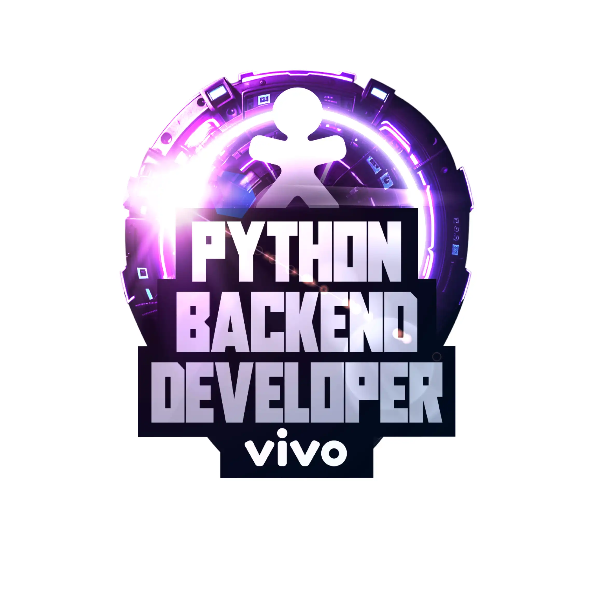

## [Bootcapm Coding The Future Vivo - Python AI Backend Developer](https://web.dio.me/track/coding-future-vivo-python-ai-backend-developer?tab=about)

**No bootcamp, serão trabalhadas habilidades de codificação em Python,
incluindo funções e estruturas de dados, bem como conceitos de orientação a
objetos (POO). Haverá integração com os frameworks FastAPI e LangChain,
além de um aprofundamento em desenvolvimento web através da construção
de APIs utilizando TDD onde projetos práticos, desafios de
código e mentorias com experts da DIO estão inclusos.**

**Também serão explorados temas avançados em Python, tendências tecnológicas para 2024 e aplicações práticas de Inteligência Artificial divididos entre 6 atividades**:

### Atividades:

- Python Essencial e Desenvolvimento Colaborativo com Git

- Dominando Python e Suas Estruturas de Dados

- Orientação a Objetos e Boas Práticas em Python

- Bancos de Dados SQL e NoSQL Para Devs Backend

- Explorando o FastAPl na Prática com TDD

- Desmistificando os Pilares da Inteligência Artificial (IA)

### Mentorias:

- Mentorias (Live): Momento em que você irá se inspirar nos talentos das empresas mais inovadoras do mundo, podendo interagir ao longo da live e até fazer perguntas sobre carreira e tecnologia.

- Desafio de Código: Coloque em prática todo o conhecimento adquirido nas aulas e teste o seu conhecimento na resolução de um desafio.

- Desafio de Projeto: Construa o seu portfólio construindo projetos práticos com o conhecimento adquirido ao longo das aulas.

- Ranking: Cada bootcamp possui um ranking com premiações exclusivas, onde você pontua de acordo com as interações que você realiza em Fórum e Rooms, dos acertos que você tem em questionários e da qualidade do código que você desenvolveu nos desafios.
